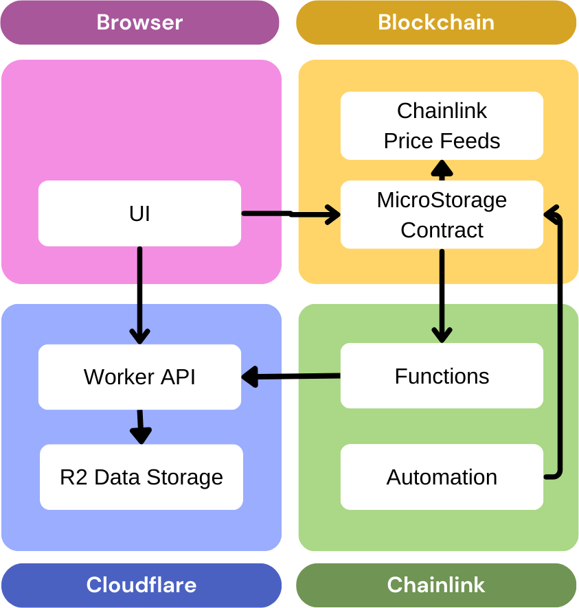
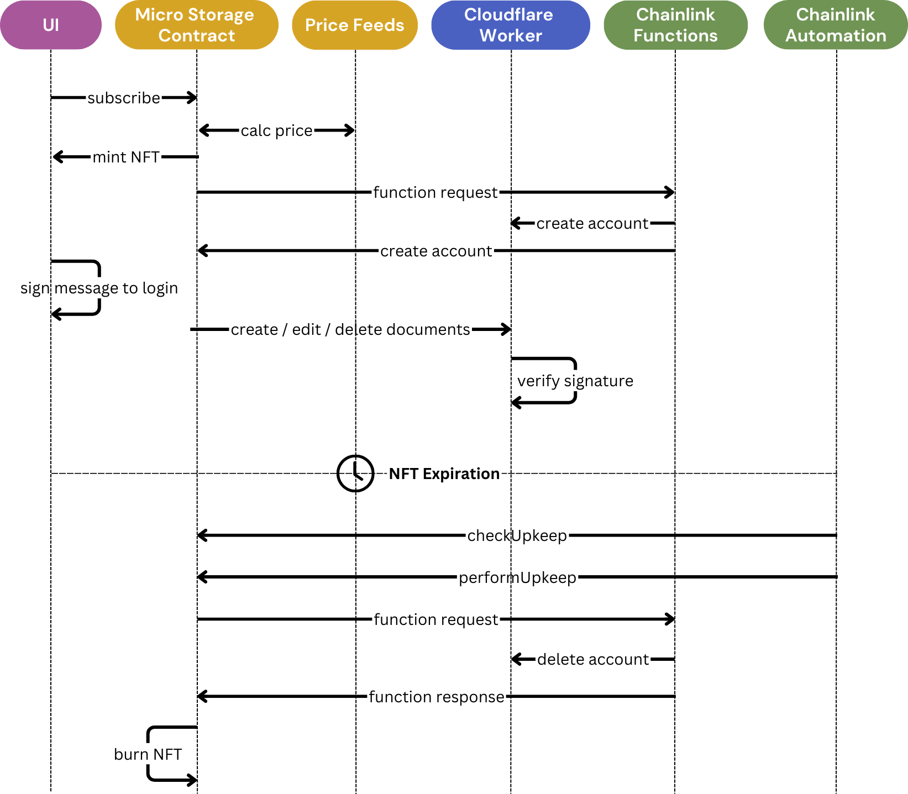

# Technical Details

## Architecture Diagram

## Sequence Diagram

An example sequence diagram of creating a subscription, and the expiration of a subscription.

## Contract Interaction

### Creating subscriptions

1. User calls `subscribe()` function of the contract, choosing the storage limit and subscription length.
2. Using price feeds, the user the subscription price is calculated and the user is charged.
3. An NFT is minted that contains the storage limit and expiration date of the subscription.
4. A request is sent to Chainlink Functions, which creates a new account for the user on the server.
5. The user signs a message to prove ownership of the NFT, so they can communicate with the server API.

### Cancelling subscriptions

1. User calls `unsubscribe()` function of the contract.
2. The user receives a refund for unused time.
3. The NFT is burned.
4. A request is sent to Chainlink Functions, which deletes the user's account on the server.

### Increasing storage limit

1. User calls `increaseLimit()` function on the contract, sending the new storage limit.
2. The user will be charged for the difference in storage limit.
3. The NFT is updated with the new storage limit.
4. A request is sent to Chainlink Functions, which increases the storage limit on the server.

### Decreasing storage limit

1. User calls `decreaseLimit()` function on the contract, sending the new storage limit.
2. A request is sent to Chainlink Functions, which checks if the limit change can be done (the user is not using more storage than the new limit).
3. The user will be refunded for the difference in storage limit.
4. The NFT is updated with the new storage limit.

### Extending subscription

1. User calls `extend()` function on the contract, sending the new subscription length.
2. The user will be charged for the difference in subscription length.
3. The NFT is updated with the new expiration date.

## Automatic Subscription Termination

If the user does not extend their subscription before it expires, the NFT will expire automatically. There is a **Chainlink Automation** job that will check for expired NFTs, and it will delete the NFT and send a request to **Chainlink Functions** to delete the user's account on the server.

